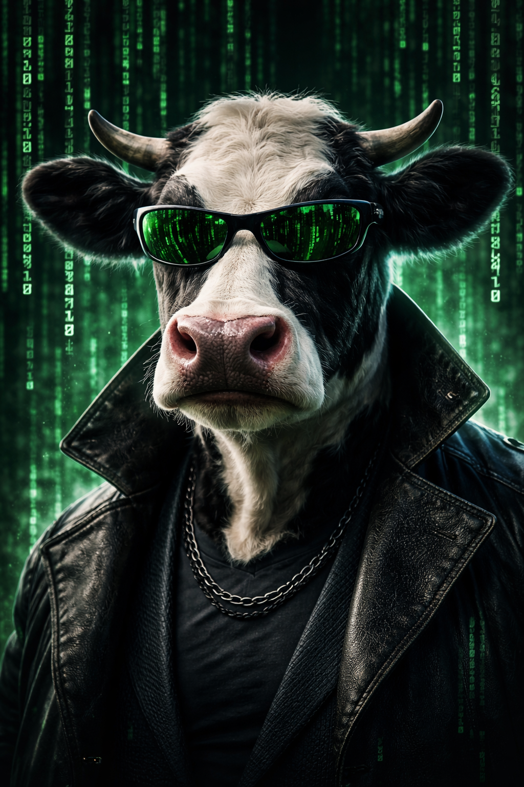
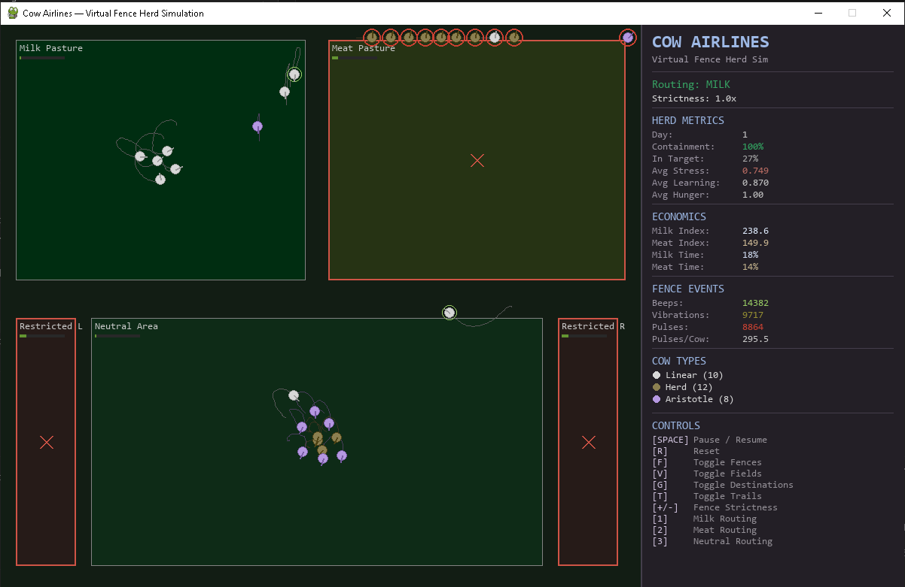

🐄✈️ Cowgorithm: Cow Airlines Pygame Simulation

Emergent routing from weak local signals

Cows graze locally. The system routes them globally.

🧠 What is this?

Cowgorithm is a Pygame simulation that demonstrates how simple local nudges can produce structured global behavior—without centralized control or scripted paths.

Using Halter-style virtual fencing and soft reward fields, a herd of autonomous agents (cows) self-organizes into:

corridors
boundary flows
destination-based routing

All from weak, probabilistic signals.

⚙️ Core Idea

Instead of telling agents where to go, the system makes certain directions:

slightly worse (fence aversion)
slightly better (reward zones)

Over time, this creates:

Weak local bias → Strong global structure

✈️🐄 Cow Airlines

This project implements the idea of “Cow Airlines”:

Agents appear to move randomly
But are subtly routed into outcomes (milk vs meat zones)
Without ever seeing a global plan

The system doesn’t command movement—it shapes what is easy vs costly

🎮 Features
🐄 Multiple agent types:
Linear — direct, noisy responders
Herd — social followers (amplify group behavior)
Aristotle — anticipatory, smoother pathing
🧭 Virtual fencing system:
Continuous aversion field (not hard walls)
Beep → vibration → pulse escalation
Learning reduces violations over time
🌱 Reward fields:
Milk vs Meat routing modes
Soft attraction (not pathfinding)
Outcome-based herd sorting
🧪 Emergent behavior:
Corridor formation
Boundary sliding
Group redirection
Route divergence from identical starting conditions
📊 Live metrics:
containment %
stress / learning
milk vs meat output
fence event tracking
🔍 What to Look For

Run the sim and watch:

cows approach a boundary → hesitate → turn
herd members copy each other → flow emerges
trails form visible corridors
switching modes → same cows, different outcomes

If it’s working, the herd will look guided, not random.

▶️ How to Run
pip install pygame
python cow_airlines_sim.py
🎛 Controls
Key	Action
SPACE	Pause / Resume
R	Reset
F	Toggle fences
V	Toggle fields
G	Toggle destinations
T	Toggle trails
+/-	Adjust fence strictness
1	Milk routing
2	Meat routing
3	Neutral routing
🧩 Architecture (High-Level)
cow.py → agent behavior (movement, learning, memory)
fence_system.py → continuous field + event escalation
environment.py → zones, grass, spatial layout
economics.py → milk/meat metrics
ui.py → rendering + dashboard
config.py → tunable parameters
🧠 Why This Matters

This is a minimal example of a broader principle:

Systems don’t need to control agents directly—
they just need to shape the environment those agents move through.

This pattern appears in:

markets (liquidity / gamma / flows)
traffic systems
swarm behavior
distributed AI agents
🔥 Key Insight

Change the field → change the outcome
without changing the agent

🚀 Future Directions
GIF export for shareable runs
Larger herd simulations
Rust/MiroZero agent port
Market analog overlays (price corridors, liquidity zones)
Multi-herd interaction
🐄 Final Thought

The cow doesn’t know the route.
It just knows which direction feels worse.
